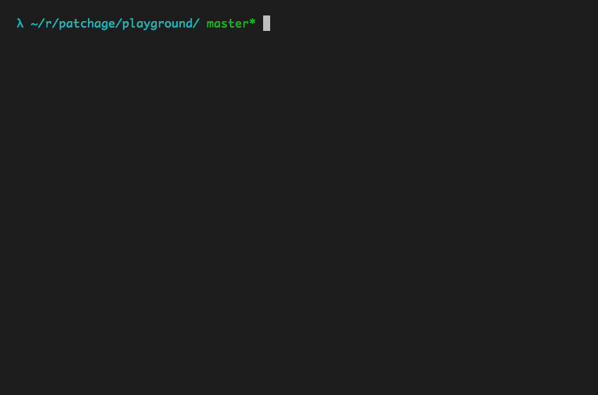

<h1>📦 Patchage</h1>

Install packages with opinionated configs.

## About

**⚠️ Patchage is currently in alpha!**

Patchage is a CLI utility to quickly install node modules and provide opinionated configs with them. See the [patches directory](tree/master/patches) for more information on how it works.



## Development

### Monitor `src` directory and automatically build project

```bash
npm run start:dev
```

### Install patchage from source

```bash
git clone ...
cd patchage
npm install
npm run build
npm install -g .
```

The binary `patchage` is now available:

```bash
patchage
```
